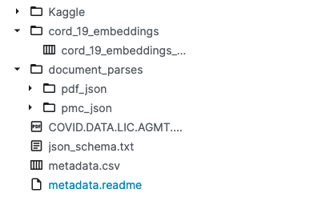
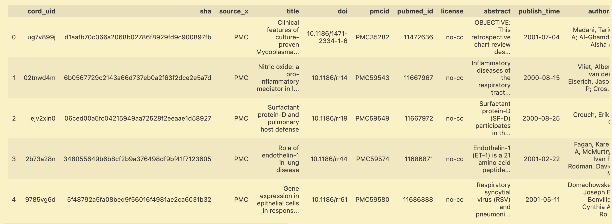
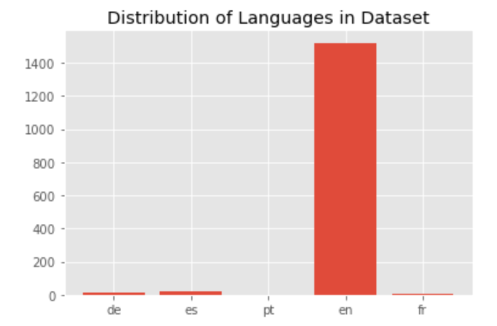
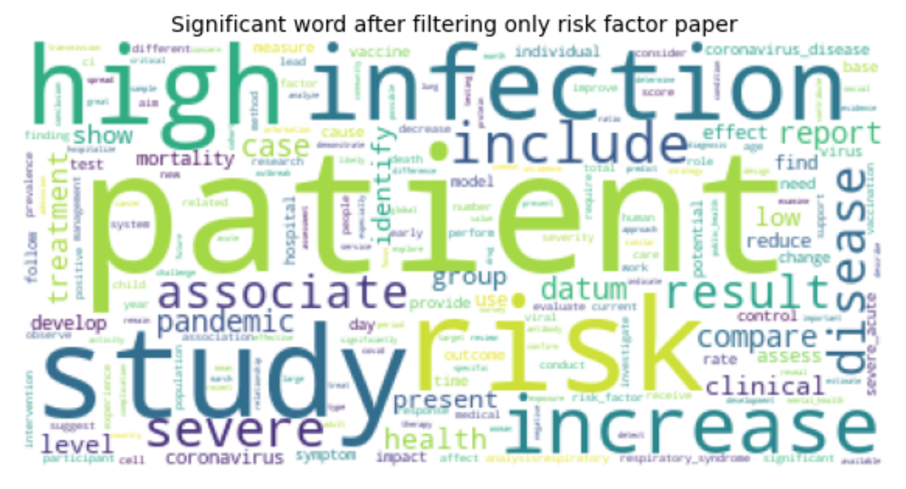
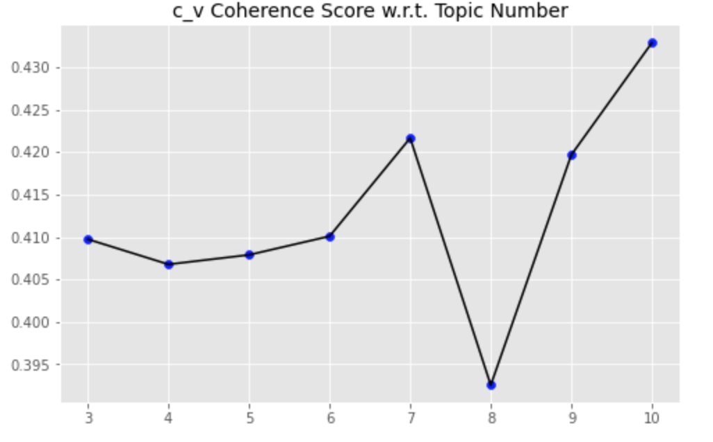
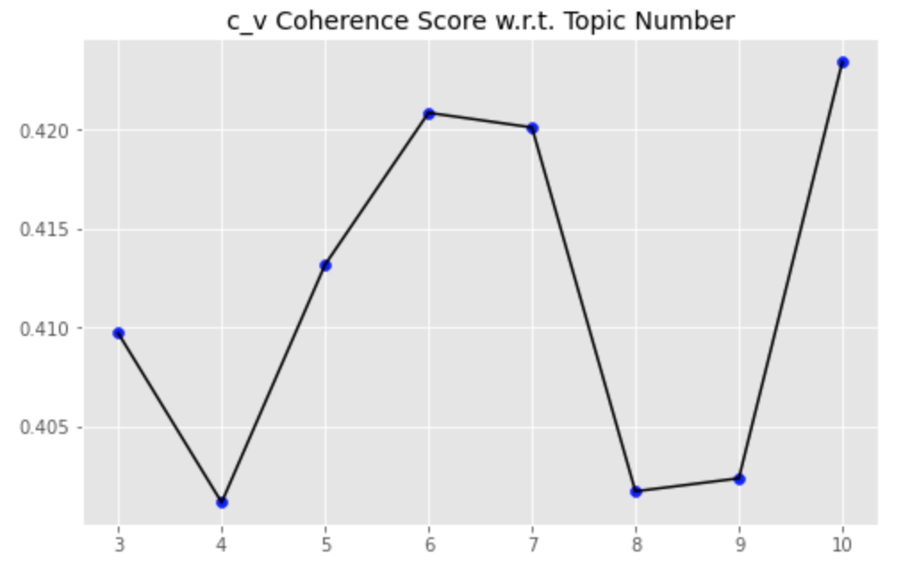
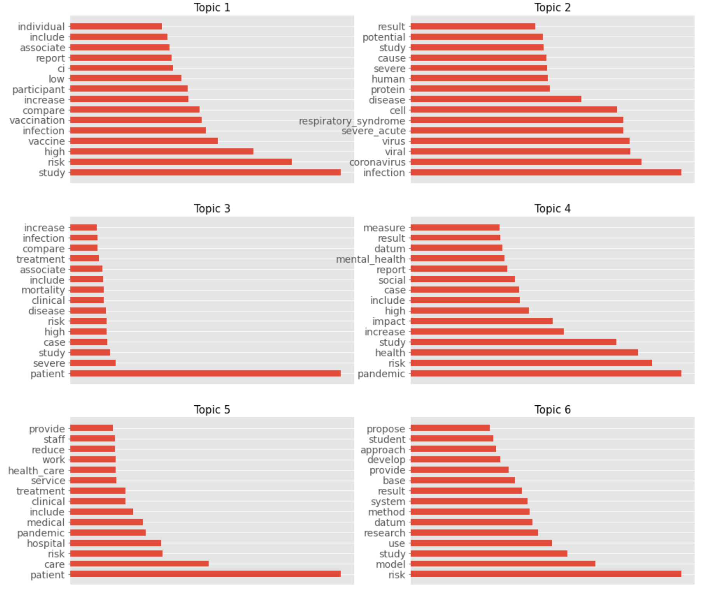

# Introduction

## Introduction

COVID-19 is the disease caused by the Sar-COV-2 virus that originated in China at the end of the year 2019. Over the time, studies have shown that there is some form of background diseases and risk factors that can hugely affect the severity cases rate of COVID-19. This project will apply NLP and text mining methods in order to explore the CORD-19 dataset and extract background diseases and risk factors.  

# State of the art

## State of the art

In this project we used multiple state of the art NLP and Data Science libraries.

- Numpy,Pandas: Formatting the data and the calculations. 
- Matplotlib: Library for drawing the charts and figures.
- Scikit-learn: LDA and T-SNE models.
- Spacy,Gensim, and NLTK: Important NLP libraries.
- Scispacy: NER,Spacy models for science papers. 
- Bokeh: A library for visualising interacted charts.


# Data exploration

## Data exploration

### CORD-19 dataset
{height=50%}

## General Information

The metadata consist of more than one millions articles.



## General Information

### Columns in the metadata
```python
['cord_uid', 'sha', 'source_x', 'title', 'doi',
 'pmcid', 'pubmed_id', 'license', 'abstract', 
 'publish_time', 'authors', 'journal', 
 'mag_id', 'who_covidence_id', 'arxiv_id', 
 'pdf_json_files', 'pmc_json_files', 'url', 's2_id']
```

## Language status

::: columns

:::: column

As can be observed on a graph most of the papers are written in english. However, there were some exceptions.  

During this part, we deleted all non-english articles by using langdetect library.
::::

:::: column

{height=50%}

::::

:::

# Data preprocessing

## Data preprocessing

- Converting JSON format into DataFrame format.
- Removing all non-english paper.
- Removing special characters
- Removing numbers
- Tokenizing.
- Removing stopwords.
- Stemming.
- Lemmatisation.


## Data preprocessing

### Converting JSON format into DataFrame format.

- Merging body text into the dataframe with metadata
- Adding columns that define language of paper
- Removing unecessary columns.

### Data Cleaning 
- Filtering out papers in english language.
- Using regex to remove special characters, numbers.
- Removing stopwords

## Data preprocessing

### Stemming and Lemmatisation
- Lowering inflection of words to their root forms
- NLTK library was used in order to perform these methods.

## Data preprocessing


# Data processing

## Data processing

- Data selection
    - Selecting articles with risk factors and severity key-words.
    - Clustering using Latent Dirichlet Allocation.

- NER (Named-entity recognition).

## Risk factors and severity paper filtering

- Creating a dictionary of key words related to risk factors and severity.
- Filtering out papers that contain words in the pre-defined dictionary.

## Risk factors and severity paper filtering



## LDA

In natural language processing, the latent Dirichlet allocation (LDA) is a generative statistical model that allows sets of observations to be explained by unobserved groups that explain why some parts of the data are similar.

The LDA algorithm structure:

- Providing to an algorithm a certain number of topics.
- The algorithm is assigning every word to a temporary topic. 
- The algorithm is checking and updating topic assignments.

## LDA

::: columns

:::: column

{height=50%}

{height=50%}

::::

:::: column

The coherence score measures how similar these words are to each other. The higher the coherence score is, the more suitable the topic number should be.
::::

:::

## LDA



## NER

Named entity recognition (NER) is the extraction-method that seeks to locate and classify named entities in text into pre-defined categories such as the names of persons, organizations, locations, expressions of times, quantities, monetary values, percentages. In our case it’s biomedical entities: diseases,chemicals etc. 

We used Scispacy library with different SpaCy models for biomedical text processing.

## NER

### Scispacy
- Pretrained model for Science Papers.
- We used en_ner_bc5cdr_md model that operates with for biomedical entities(chemicals,genes,diseases).

# Result

## Result

Example of a result table.

| 0   | chronic obstructive pulmonary disease copd                                                                                                   | DISEASE |
|-----|----------------------------------------------------------------------------------------------------------------------------------------------|---------|
| 1   | death                                                                                                                                        | DISEASE |
| 3   | copd                                                                                                                                         | DISEASE |
| 9   | dyspnea                                                                                                                                      | DISEASE |
| 10  | cough                                                                                                                                        | DISEASE |
| 11  | copd pulmonary function                                                                                                                      | DISEASE |
| 13  | respiratory tract infection                                                                                                                  | DISEASE |
| 14  | chronic unstable disease system malignancy                                                                                                   | DISEASE |
| 19  | obstructive pulmonary disease                                                                                                                | DISEASE |
| 21  | copd airflow                                                                                                                                 | DISEASE |
| 25  | hypertension                                                                                                                                 | DISEASE |
| 26  | atherosclerotic heart disease                                                                                                                | DISEASE |
| 27  | bronchiectasis                                                                                                                               | DISEASE |

## Conclusion

To conclude, the deep text-analysis was made. The data was filtered out by using several techniques such as LDA topic modeling and NER. As a result we generated the dataframe table with all covid-related diseases being sorted by a tag «Disease».

## Future improvement

- Creating a knowledge graph.
- Calculating the severity rate.

## Thank you for your attention!

Thank you for your attention!
