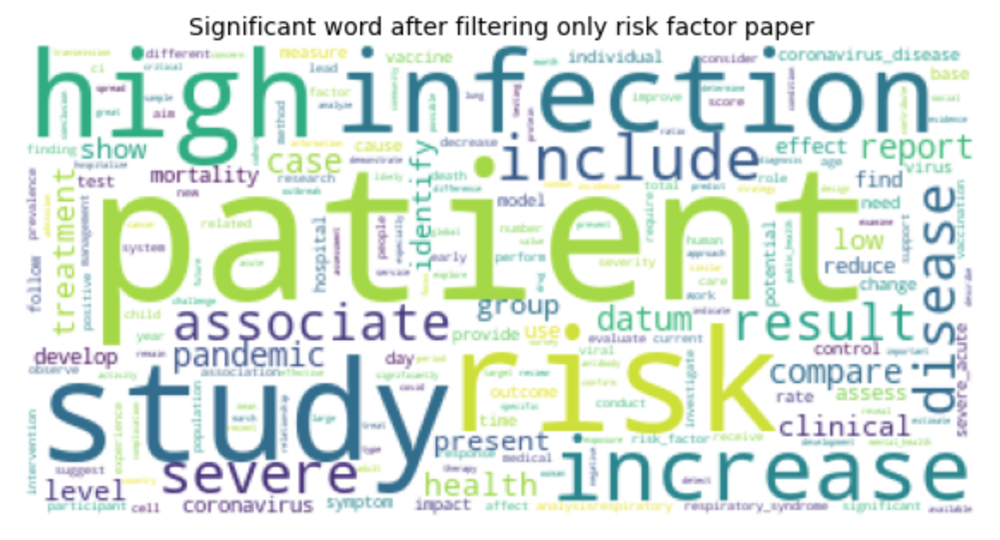
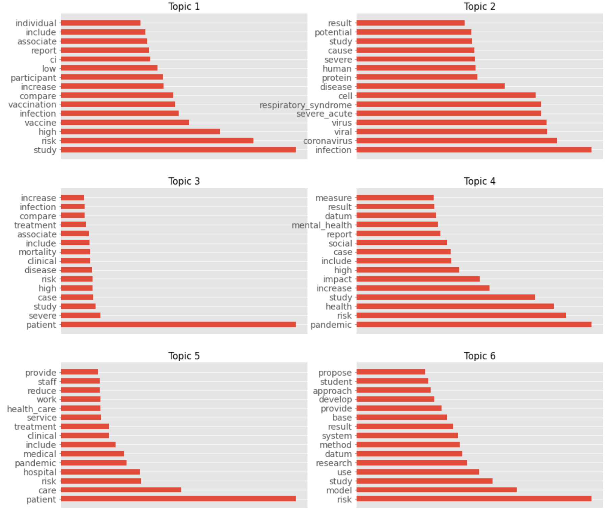

---
# pandoc report.md -o pdf/report.pdf --from markdown --template eisvogel.tex --listings --pdf-engine=xelatex --toc --number-sections

papersize: a4
lang: en-US
# geometry:
#     - top=30mm
#     - left=20mm
#     - right=20mm
#     - heightrounded
# mainfont: "Helvetica"
# sansfont: "Helvetica"
# monofont: "Helvetica"
documentclass: article
title: Text mining for exploration of COVID-19 severity factors

author: \textbf{LAI Khang Duy} \newline
        \textbf{Mariia KLIMINA} \newline
        \newline
        \newline
        \textit{Université Paris Cité} \newline 
        \textit{UFR des Sciences Fondamentales et Biomédicales}
footer-left: Université Paris Cité
date: 03-05-2022
titlepage: true
toc-own-page: true
# lof: true
# lof-own-page: true
titlepage-logo: assets/images/pariscite-logo.png
header-includes: 
      - |
        ``` {=latex}
        \let\originAlParaGraph\paragraph
        \renewcommand{\paragraph}[1]{\originAlParaGraph{#1} \hfill}
        ```
...

# Abstract

COVID-19 is the disease caused by the Sar-COV-2 virus that originated in China at the end of the year 2019. Over the time, studies have shown that there is some form of background diseases and risk factors that can hugely affect the severity cases rate of COVID-19. This project will apply NLP and text mining methods in order to explore the CORD-19 dataset and extract background diseases and risk factors.  


# State of the art

In this project we used multiple state of the art NLP and Data Science libraries. 

- Numpy, Pandas: Formatting the data the and calculations.

- Matplotlib: Library for drawing the charts and figures.

- Scikitlearn: LDA and TSNE models.

- Spacy, Gensim and NLTK: Important NLP libraries.

- Scispacy: NER, Spacy model for science papers.

- Bokeh: A library for visualising interacted charts.

# Project Structure

During this project we worked with CORD-19 dataset. CORD-19 is a data collection of over one million scholarly articles, including over 350,000 with full text, about COVID-19, SARS-CoV-2, and related coronaviruses. The amount of data collected in CORD-19 is providing us an opportunity for a deep and various analysis, and allowing us to apply different NLP techniques such as LDA (Latent Dirichlet Allocation) and NER (Named-entity recognition). The main goal of this part is to present a structure of the project.

The coding process consisted of 4 parts: Data Exploration, Preprocessing, Data selection, Named-entity recognition application.

- Data Exploration

- Preprocessing
    - Reformating the json data to csv dataframe.
    - Removing all non-english paper.
    - Tokenizing.
    - Removing stopwords.
    - Stemming.
    - Lemmatisation.
 
- Data selection
    - Selecting articles with risk factors and severity key-words.
    - Clustering using Latent Dirichlet Allocation.

- Applying NER (Named-entity recognition).


# Data exploration

In this part we will cover the main features that we discovered during the data exploration. The successful outcome of this block helped us to apply preprocessing and understood the data we were working with. It is important to mention, that in this part we used only metadata dataset which contained all useful information for the analysis. 

## Dataset information

This block is divided by two parts: the general information of a dataset and a language specificity.

- First of all, as we can see on a picture, at our disposal are more than one milion papers.


- Secondly, the metadata data collection consists of following columns. 

```python
['cord_uid', 'sha', 'source_x', 'title', 'doi', 'pmcid', 'pubmed_id', 
'license', 'abstract', 'publish_time', 'authors', 'journal', 'mag_id', 
'who_covidence_id', 'arxiv_id', 'pdf_json_files', 'pmc_json_files', 
'url', 's2_id']
```
For a better data collection understanding, it is crucial to know its components and its structure: 

- `cord_uid`:  A `str`-valued field that assigns a unique identifier to each CORD-19 paper. 

- `sha`:  A `List[str]`-valued field that is the SHA1 of all PDFs associated with the CORD-19 paper.

- `source_x`:  A `List[str]`-valued field that is the names of sources from which we received this paper.

- `title`:  A `str`-valued field for the paper title

- `doi`: A `str`-valued field for the paper DOI
- `pmcid`: A `str`-valued field for the paper's ID on PubMed Central.

- `pubmed_id`: An `int`-valued field for the paper's ID on PubMed. 
 
- `license`: A `str`-valued field with the most permissive license we've found associated with this paper.

- `abstract`: A `str`-valued field for the paper's abstract

- `publish_time`:  A `str`-valued field for the published date of the paper.  This is in `yyyy-mm-dd` format. 

- `authors`:  A `List[str]`-valued field for the authors of the paper.

- `journal`:  A `str`-valued field for the paper journal.

- `who_covidence_id`:  A `str`-valued field for the ID assigned by the WHO for this paper.

- `arxiv_id`:  A `str`-valued field for the arXiv ID of this paper.

- `pdf_json_files`:  A `List[str]`-valued field containing paths from the root of the current data dump version to the parses of the paper PDFs into JSON format.  
- `pmc_json_files`:  A `List[str]`-valued field. Same as above, but corresponding to the full text XML files downloaded from PMC, parsed into the same JSON format as above.

- `url`: A `List[str]`-valued field containing all URLs associated with this paper.

- `s2_id`:  A `str`-valued field containing the Semantic Scholar ID for this paper.


To be more clear, the number of files that we can work with in the directory is approximately over 300000 json files, not one million. The explanation for this is that some papers in the metadata dataset is not available in the json format for us to process and some of them are duplicated.

## Language status of the dataset

During this project, we agreed to work only with english-written articles. That is why we made an analysis that you can see on an image below. As can be observed most of the articles are meeting the requirements. However, papers that did not respond to the criteria were deleted in the preprocessing part.

In order to detect english-written papers, we used a library called ```langdetect```. To speed up the language detecting process we used only first 50 words from a body text. The practice shows that this amount of words is enough for algorithm to understand if it's english language or not.

- This part of the code is trying to analyse the first 50 words of the body text, however if the number of words is lower than 50, the whole text is processed.

```python
if len(text) > 50:
        lang = detect(" ".join(text[:50]))
elif len(text) > 0:
        lang = detect(" ".join(text[:len(text)]))
```

- If the detection of the language is impossible while using the body part, the algorithm will try to do the same job but with an abstract.

```python
try:
        lang = detect(df.iloc[ii]['abstract_summary'])
except Exception as e:
        lang = "unknown"
```

- In other case, the language marked as unknown.


For the final dataframe we randomly picked 10000 english-written papers. 


# Data preprocessing

The second part of this project is data preprocessing. It's important to mention, that at this step, we are using not only the metadata dataset, but also we are working with full collection of articles.

- Filtering necessary information from metadata and body texts.
- Dropping non-english papers
- Cleaning the data
   - Removing special characters 
   - Removing numbers
   - Tokenization
   - Lemmatisation
   - Stemming
- Removing rows with duplicated and empty abstracts

## Handling multiple languages

As we mentioned earlier, approximately 95% of papers are written in English. To sort them out we created a new column in our dataframe named ```language``` and then used the code below for creating a new dataset only with english-written papers. 

```python
df = df_covid[df_covid['language'] == 'en'] 
```

## Transfering the JSON to Pandas Dataframe format

The original data is collected in json format, where each file is a representation of an article. However, it is impossible to use
python preprocessing libraries on json artciles. We solved this issue by transfering all data from json collection into Pandas Data Frame.

## Removing special characters and numbers

In this part of data preprocessing we removed all numbers and special characters(dots, commas, etc) using the python ```regex``` library.

```
text = re.sub(r'[^\w\s]', '', str(text).lower().strip())
    pat = r'\d+'
    text = re.sub(pat, '', text)
```

## Tokenization
A tokenization process divides data into chunks of information that can be considered as discrete elements. The token occurrences in a document can be used directly as a vector representing that document.

In this case we used ```split()``` method to tokenize the data.

## Stemming
Stemming is a natural language processing technique that lowers restore words to their root forms, hence aiding in the preprocessing of text, words, and documents for text normalization. The performance of NLP might be affected with out stemming.

```    
if flg_stemm == True:
        ps = nltk.stem.porter.PorterStemmer()
        lst_text = [ps.stem(word) for word in lst_text]
```

## Lemmatisation
Lemmatization is aslo a NLP technique which is used to reduce words to a normalized form.

```
if flg_lemm == True:
        lem = nltk.stem.wordnet.WordNetLemmatizer()
        lst_text = [lem.lemmatize(word) for word in lst_text]
```

## Risk factor and severe paper filtering

Before applying NER, we sorted papers in a dataframe with a common topic, such as "severe", "symptoms" and "risk factors". In order to do it right and in an objective way, we filtered out papers that contained one of the words that was related to risk factors or severity in a predefined dictionary.The keywords can be observd in a word cloud below.




## Data processing

At this point of our project, the data is clean and sorted. It means that it is suitable for NLP-training. 

The first thing we did was Topic Modeling using Latent Dirichlet Allocation(LDA). LDA is a generative statistical model that allows sets of observations to be explained by unobserved groups that explain why some parts of the data are similar. It was crucial for us to use LDA because by using topic modeling we discovered a range of articles that was very close to our project theme: risk factors, severity, severe,etc. After successfully applying LDA and choosing the right topic, we fitted the data to the NER model. NER  — (Named Entity Recognition) is a subtask of information extraction that seeks to locate and classify named entities mentioned in unstructured text into predefined categories such as person names, organizations, locations, medical codes, time expressions, quantities, monetary values, percentages, etc. For this project we used NER model that can detect diseases. 

# Topic modeling

The LDA algorithm structure:

- Providing to an algorithm a certain number of topics. 
- The algorithm is assigning every word to a temporary topic.
- The algorithm is checking and updating topic assignments.

## Evaluation method: coherence score

For the evaluation method we used the coherence score. Coherence score in topic modeling is a measure of how interpretable the topics are to humans. In this case, topics are represented as the top N words with the highest probability of belonging to that particular topic. 

{ width=50% }

Briefly, the coherence score measures how similar these words are to each other. The higher the c_v coherence score is, the more suitable the topic number should be.


{ width=50% }

We run the LDA model in the range of 3 to 11 topics in order to see which one will perform better.


Each time we iterate the c_v coherence score, the value varies. However, for the next step, we decided to work with the data from topic 6.


## Final dicision in applying Latent Dirichlet Allocation

Running LDA with topic number 6.

```python
lda_model = LdaMulticore(corpus=corpus_risk_article,
                        id2word=id2token_risk_article,
                        num_topics=6, 
                        random_state=98,
                        chunksize=100,
                        passes=10,
                        iterations=50,
                        decay=0.5,
                        per_word_topics=True,)
```


Top of the keyword for each topic.



After examinating the most significant keywords, we made the conclusion that topic 3 was the closest to severity symptoms. Topic 3 has the following  keywords: ‘mortality’, ‘high’, ‘risk’, ‘patient’, ‘case’, ‘severe’, etc. Then, we extracted all documents from the topic 3. Having all papers filtered, we can transfer them to the NER model. 

Extraction of the document’s topic by using get_document_topics method. 
 
```python
document_topic = lda_model.get_document_topics(corpus_risk_article[i])
document_topic_distribution.append(document_topic)
for idx,document_topic in enumerate(document_topic_distribution):
    for topic_idx,prob in document_topic:
        document_topic_matrix[idx][topic_idx] = prob
```
As a result, we have the percentage of each topic that can be found in the pull of the documents.


# Named-identity recognition

`Scispacy` is a library with different SpaCy models for biomedical text processing. In this step, we used a pretrained model based on BC5CDR corpus. This model can be installed through Scispacy with `en_ner_bc5cdr_md`.


```python
import scispacy
import spacy
nlp_model_bc5cdr = spacy.load("en_ner_bc5cdr_md")
```
- Load in `en_ner_bc5cdr_md`.

```python
entities = []
labels = []
position_start = []
position_end = []

for body_text in tqdm(df['body_text_clean'][:200]):
    doc = nlp(body_text)
    

    for ent in doc.ents:
        entities.append(ent.text)
        labels.append(ent.label_)
        position_start.append(ent.start_char)
        position_end.append(ent.end_char)

    named_entities_df = pd.DataFrame({'Entities':entities,'Labels':labels,'Position_Start':position_start, 'Position_End':position_end})
```

- Creating the dictionary that contains extracted entities.

```python
df_disease = named_entities_df.drop_duplicates(subset=['Entities'])
```

- Exporting the final file with only the `DISEASE` tag.

```python
df_disease = df_disease[df_disease['Labels'] == 'DISEASE]
df_disease.to_csv('disease.csv')
```


# Result

As a final result we extracted the most common diseases that are connected with COVID-19. In order to make it more presentable, the table with a list of diseases was generated. 

Head of the file `disease.csv`

| 0   | chronic obstructive pulmonary disease copd                                                                                                   | DISEASE |
|-----|----------------------------------------------------------------------------------------------------------------------------------------------|---------|
| 1   | death                                                                                                                                        | DISEASE |
| 3   | copd                                                                                                                                         | DISEASE |
| 9   | dyspnea                                                                                                                                      | DISEASE |
| 10  | cough                                                                                                                                        | DISEASE |
| 11  | copd pulmonary function                                                                                                                      | DISEASE |
| 13  | respiratory tract infection                                                                                                                  | DISEASE |
| 14  | chronic unstable disease system malignancy                                                                                                   | DISEASE |
| 19  | obstructive pulmonary disease                                                                                                                | DISEASE |
| 21  | copd airflow                                                                                                                                 | DISEASE |
| 25  | hypertension                                                                                                                                 | DISEASE |
| 26  | atherosclerotic heart disease                                                                                                                | DISEASE |
| 27  | bronchiectasis                                                                                                                               | DISEASE |
| 43  | respiratory doctor small number                                                                                                              | DISEASE |
| 45  | critically ill                                                                                                                               | DISEASE |
| 46  | chronic disease community                                                                                                                    | DISEASE |
| 47  | chronic disease                                                                                                                              | DISEASE |
| 57  | respiratory muscle reset sensitivity respiratory center co improve sleep quality                                                             | DISEASE |
| 60  | hypercapnia                                                                                                                                  | DISEASE |
| 65  | copd p                                                                                                                                       | DISEASE |
| 69  | pneumococcal disease                                                                                                                         | DISEASE |
| 72  | hypertension diabetes copd                                                                                                                   | DISEASE |
| 73  | pneumonia                                                                                                                                    | DISEASE |
| 80  | copd asthma steroidrelated                                                                                                                   | DISEASE |
| 84  | cellsμl                                                                                                                                      | DISEASE |
| 103 | reduction ae frequency helped maintain lung function                                                                                         | DISEASE |
| 112 | coronavirus disease                                                                                                                          | DISEASE |
| 113 | covid selflimiting disease                                                                                                                   | DISEASE |
| 115 | acute respiratory syndrome coronavirus sarscov nucleic acid                                                                                  | DISEASE |
| 116 | fever cough shortness breath                                                                                                                 | DISEASE |
| 117 | infection                                                                                                                                    | DISEASE |
| 118 | presymptomatic severe presymptomatic covid                                                                                                   | DISEASE |
| 119 | presymptomatic nonsevere presymptomatic covid                                                                                                | DISEASE |
| 123 | coronavirus pneumonia                                                                                                                        | DISEASE |
| 127 | respiratory distress                                                                                                                         | DISEASE |
| 131 | respiratory failure                                                                                                                          | DISEASE |
| 132 | shock                                                                                                                                        | DISEASE |
| 133 | organ failure                                                                                                                                | DISEASE |
| 134 | hypertension diabetes cardiovascular disease cerebrovascular disease cancer chronic obstructive pulmonary disease                            | DISEASE |
| 135 | kidney disease                                                                                                                               | DISEASE |
| 136 | liver disease immunodeficiency                                                                                                               | DISEASE |
| 138 | illness respectively commonest symptom symptomatic patient disease                                                                           | DISEASE |
| 139 | admission fever n cough n shortness breath                                                                                                   | DISEASE |
| 140 | respiratory distress fatigue                                                                                                                 | DISEASE |
| 141 | muscle soreness                                                                                                                              | DISEASE |
| 142 | diarrhea                                                                                                                                     | DISEASE |
| 143 | headache                                                                                                                                     | DISEASE |
| 144 | dizziness                                                                                                                                    | DISEASE |
| 145 | nausea n vomiting                                                                                                                            | DISEASE |
| 148 | hypertension diabetes                                                                                                                        | DISEASE |
| 149 | groundglass opacity                                                                                                                          | DISEASE |
| 150 | pleural thickening                                                                                                                           | DISEASE |
| 151 | pleural effusion                                                                                                                             | DISEASE |
| 155 | liver kidney common                                                                                                                          | DISEASE |
| 156 | heart liver function                                                                                                                         | DISEASE |
| 160 | lymphocytopenia                                                                                                                              | DISEASE |
| 163 | nonseverely ill                                                                                                                              | DISEASE |
| 164 | pandemic sarscov infection                                                                                                                   | DISEASE |
| 166 | heart liver kidney                                                                                                                           | DISEASE |
| 167 | abnormal c abnormal rate organ including heart liver kidney fold normal range d value laboratory indicator admission vertical axis indicates | DISEASE |
| 169 | respiratory distress syndrome                                                                                                                | DISEASE |
| 170 | sepsis congestive heart failure                                                                                                              | DISEASE |
| 172 | lower respiratory tract infection                                                                                                            | DISEASE |
| 173 | bacterial spectrum pulmonary coinfections superinfection                                                                                     | DISEASE |
| 176 | tumor necrosis                                                                                                                               | DISEASE |
| 177 | presymptomatic nonsevere presymptomatic patient based laboratory                                                                             | DISEASE |
| 178 | stage disease                                                                                                                                | DISEASE |
| 179 | bronchopulmonary dysplasia                                                                                                                   | DISEASE |
| 180 | neurodevelopmental impairment                                                                                                                | DISEASE |
| 181 | lung injury alveolar growth arrest                                                                                                           | DISEASE |
| 184 | fibrosis                                                                                                                                     | DISEASE |
| 189 | death bpddeath                                                                                                                               | DISEASE |
| 192 | chorioamnionitis                                                                                                                             | DISEASE |
| 193 | infection sepsis                                                                                                                             | DISEASE |
 

# Future improvement

Speaking of future improvements, it is important to emphasize two things.

First of all, it would be crucial to create a knowledge graph in order to see the relationships between different symptoms and diseases. We are sure that constructing a knowledge graph may give us a more profound and deep image of connections between severity cases and symptoms. It is a very powerful technique and can be used by researchers in order to prevent some severe cases by knowing that some diseases can lead to severe covid. Secondly, while working on this project, we found out that, in order to make this project more complex, it is important to calculate the severity rate in order to know which disease is less or more severe. To sum it up, we are hoping to continue to work on this project and implement all this improvement in future.


