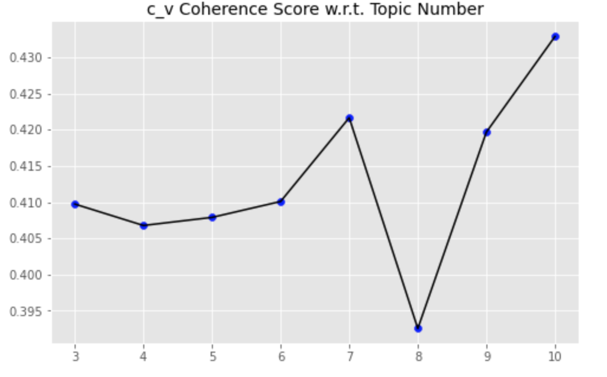

---
# pandoc report.md -o pdf/report.pdf --from markdown --template eisvogel.tex --listings --pdf-engine=xelatex --toc --number-sections

papersize: a4
lang: en-US
# geometry:
#     - top=30mm
#     - left=20mm
#     - right=20mm
#     - heightrounded
# mainfont: "Helvetica"
# sansfont: "Helvetica"
# monofont: "Helvetica"
documentclass: article
title: Text mining for exploration of COVID-19 severity factors

author: \textbf{LAI Khang Duy} \newline
        \textbf{Mariia KLIMINA} \newline
        \newline
        \newline
        \textit{Université Paris Cité} \newline 
        \textit{UFR des Sciences Fondamentales et Biomédicales}
footer-left: Université Paris Cité
date: 03-05-2022
titlepage: true
toc-own-page: true
# lof: true
# lof-own-page: true
titlepage-logo: assets/images/pariscite-logo.png
header-includes: 
      - |
        ``` {=latex}
        \let\originAlParaGraph\paragraph
        \renewcommand{\paragraph}[1]{\originAlParaGraph{#1} \hfill}
        ```
...

# Abstract

COVID-19 is the disease caused by the Sar-COV-2 virus that originated in China at the end of the year 2019. Over the time, studies have shown that there is some form of background diseases and risk factors that can hugely affect the severity cases rate of COVID-19. This project will apply NLP and text mining methods in order to explore the CORD-19 dataset and extract background diseases and risk factors.  


# Introduction

During this project we worked CORD-19 dataset. CORD-19 is a data collection of over one million scholarly articles, including over 350,000 with full text, about COVID-19, SARS-CoV-2, and related coronaviruses. The amount of data collected in CORD-19 is providing us an opportunity for a deep and various analysis, and allowed us to apply different NLP techniques such as LDA (Latent Dirichlet Allocation) and NER (Named-entity recognition). The main goal of this part is to present a structure of the project.

The coding process consisted of 4 parts: Data Exploration, Preprocessing, Data selection, Named-entity recognition application.

- Data Exploration

- Preprocessing
    - Reformating the json data to csv dataframe.
    - Removing all non-english paper.
    - Tokenizing.
    - Removing stopwords.
    - Stemming.
    - Lemmatisation.
 
- Data selection
    - Selecting articles with risk factors and severity key-words.
    - Clustering using Latent Dirichlet Allocation.

- Applying NER (Named-entity recognition).


# Data exploration

In this part we will cover the main features that we discovered during the data exploration. The successful outcome of this block helped us to apply preprocessing and understood the data we were working with. It is important to mention, that in this part we used only metadata dataset which contained all useful information for the analysis. 

## Dataset information

This block is divided by two parts: the general information of a dataset and a language specificity.

- First of all, as we can see on a picture, at our disposal are more than one milion papers.


- Secondly, the metadata data collection consists of following columns. 

```python
['cord_uid', 'sha', 'source_x', 'title', 'doi', 'pmcid', 'pubmed_id', 
'license', 'abstract', 'publish_time', 'authors', 'journal', 'mag_id', 
'who_covidence_id', 'arxiv_id', 'pdf_json_files', 'pmc_json_files', 
'url', 's2_id']
```
For a better data collection understanding, it is crucial to know its components and its structure: 

- `cord_uid`:  A `str`-valued field that assigns a unique identifier to each CORD-19 paper. 

- `sha`:  A `List[str]`-valued field that is the SHA1 of all PDFs associated with the CORD-19 paper.

- `source_x`:  A `List[str]`-valued field that is the names of sources from which we received this paper.

- `title`:  A `str`-valued field for the paper title

- `doi`: A `str`-valued field for the paper DOI
- `pmcid`: A `str`-valued field for the paper's ID on PubMed Central.

- `pubmed_id`: An `int`-valued field for the paper's ID on PubMed. 
 
- `license`: A `str`-valued field with the most permissive license we've found associated with this paper.

- `abstract`: A `str`-valued field for the paper's abstract

- `publish_time`:  A `str`-valued field for the published date of the paper.  This is in `yyyy-mm-dd` format. 

- `authors`:  A `List[str]`-valued field for the authors of the paper.

- `journal`:  A `str`-valued field for the paper journal.

- `who_covidence_id`:  A `str`-valued field for the ID assigned by the WHO for this paper.

- `arxiv_id`:  A `str`-valued field for the arXiv ID of this paper.

- `pdf_json_files`:  A `List[str]`-valued field containing paths from the root of the current data dump version to the parses of the paper PDFs into JSON format.  
- `pmc_json_files`:  A `List[str]`-valued field. Same as above, but corresponding to the full text XML files downloaded from PMC, parsed into the same JSON format as above.

- `url`: A `List[str]`-valued field containing all URLs associated with this paper.

- `s2_id`:  A `str`-valued field containing the Semantic Scholar ID for this paper.


To be more clear, the number of files that we can work with in the directory is approximately over 300000 json files, not one million. The explanation for this is that some papers in the metadata dataset is not available in the json format for us to process and some of them are duplicated.

## Language status of the dataset

During this project, we agreed to work only with english-written articles. That is why we made an analysis that you can see on an image below. As can be observed most of the articles are meeting the requirements. In addition to that, papers that do not respond to the criteria will be deleted in the preprocessing part.

In order to detect english-written papers, we used a library called ```langdetect```. To speed up the language detecting process we used only first 50 words from a body text. The practice shows that this amount of words is enough to 

- Try to detect on the first 50 words of the body text, if the number of words is lower than 50, take the whole text instead.

```python
if len(text) > 50:
        lang = detect(" ".join(text[:50]))
elif len(text) > 0:
        lang = detect(" ".join(text[:len(text)]))
```

- If first 50 words does not work, try to detect with the whole body.

- If we cannnot detect the language using the body part, try to detect on the abstract.

```python
try:
        lang = detect(df.iloc[ii]['abstract_summary'])
except Exception as e:
        lang = "unknown"
```

- In other case, mark the language as unknown.

This is the final result when we randomly pick 10000 papers. It is obviously that the most out of dataset is written in English.


# Preprocessing

The second part of this project is preprocessing. This step will first clean the data, including transfer the JSON file that be used in the dataset to pandas dataframe, which is more common to process. In the preprocessing block, we will remove the row with duplicated and empty abstract.

## Handling multiple languages

As in the data explore, more than 95% of papers are written in English. We have already add a new column named ```language``` in the dataframe. It could be easily filtered out with

```python
df = df_covid[df_covid['language'] == 'en'] 
```

## Change from JSON to a more convinient format

```json

```

## Special characters and number remove

Convert to lowercase and remove punctuations and characters and then strip.

```
text = re.sub(r'[^\w\s]', '', str(text).lower().strip())
    pat = r'\d+'
    text = re.sub(pat, '', text)
```

## Tokenization

Simply using ```split()``` to tokenize the data.

## Stemming

```    
if flg_stemm == True:
        ps = nltk.stem.porter.PorterStemmer()
        lst_text = [ps.stem(word) for word in lst_text]
```

## Lemmatisation


```
if flg_lemm == True:
        lem = nltk.stem.wordnet.WordNetLemmatizer()
        lst_text = [lem.lemmatize(word) for word in lst_text]
```

# Clustering


{ width=50% }

t

t

t

{ width=50% }

# Named-identity recognition

Scispacy
t
t

t
t

t


# Future improvement

Knowledge graph

# References

https://github.com/allenai/cord19 - this for the metadata desrp
